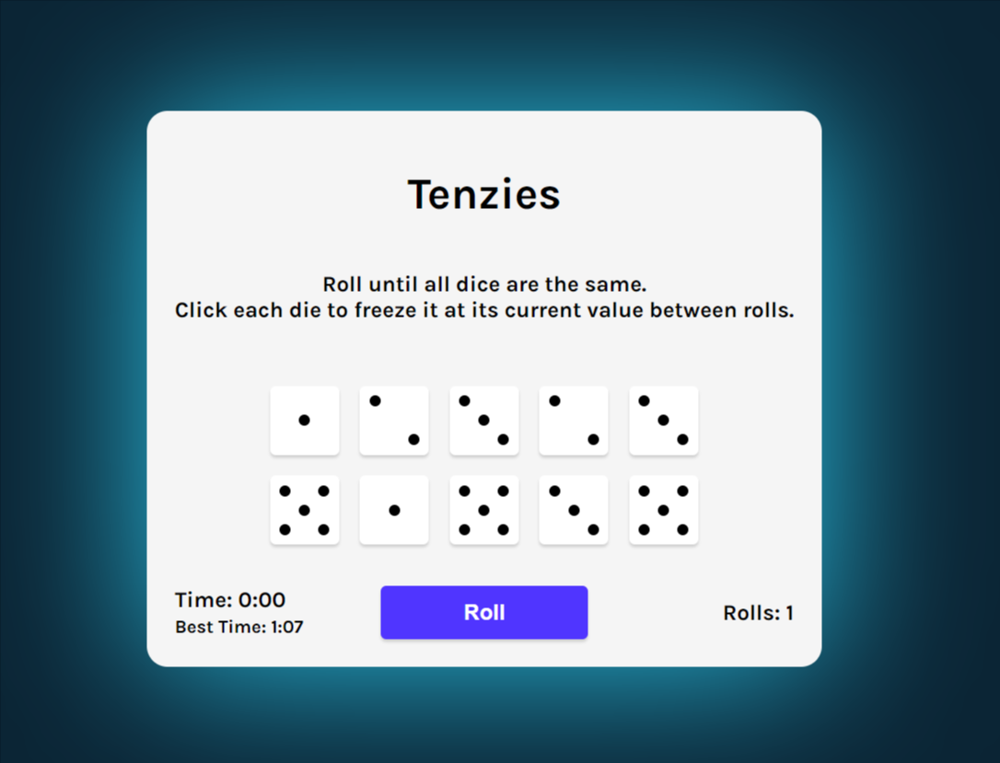

# React Tenzies game

The project is to build a game of tenzies.
It is bootstraped with Vite.js.

🔗 **Live preview:** [here](https://singular-concha-d934bf.netlify.app/)

### Screenshot

## Built with

### Technologies

- HTML
- CSS
- React JS

### Tools

- Vite

## Features

- game of Tenzies: you have to roll 10 dice and keep the similar ones until you have all of them with the same value.
- timer (best time is kept in localStorage)
- roll count
- css dice with grid CSS

## What I learned

- Better knowledge of **React** use of useState and useEffect.

## Author

👤 **Edouard Desgrée**

- GitHub: [edesgree](https://github.com/edesgree)

#### Created while working on the [The Odin Project](https://www.theodinproject.com/) and a [scrimba](https://scrimba.com/) class
